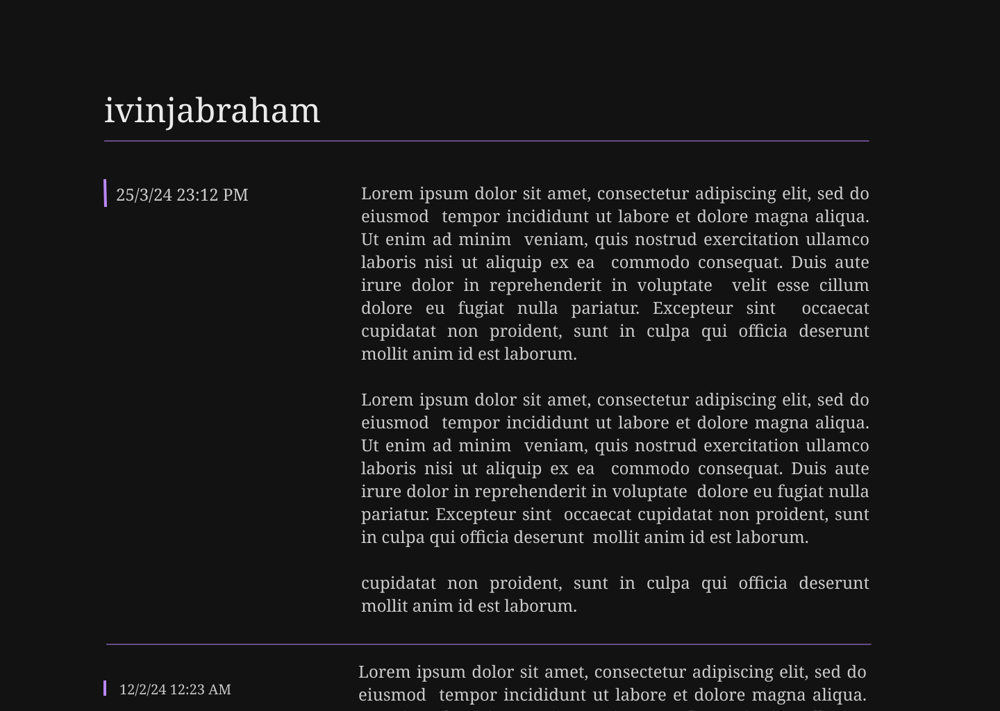

I've been meaning to build a blog for _a while_ now. I've made at least two Figma designs and tried out hosting a web server (for free!) using [Shuttle](https://www.shuttle.dev/). But I never got around to putting everything together. I blame this partly on how tedious it is to make frontends from a design; it's menial work that should be automated any day now. I was going to sit down and get it done yesterday. But while looking for tech stacks that didn't seem like over-engineered nonsense, I happened across [Astro](https://astro.build/) and their themes, and it was a no-brainer. I suppose now all that's left to do is to write blogs.

 

  
<em>What could have been.</em>

 

I suppose I should give a little introduction; my name is Ivin, and at the time of writing, I'm a junior (or a third-year) Computer Sci. Engineering student. I'm not particularly attached to Engineering or Computers. But I have been using the latter for a significant portion of my life, and I was having fun programming odd stuff in High School, so Software Engineering seemed a good fit. I've always thought I'm rather resistant to regret because of my ability to cope convincingly with my present. But I'd still say I have no regrets about choosing this career. Building, deploying and maintaining software is a lot more engaging than the silly programming I'd do as a kid.

Over these last few years, I've gained an appreciation for code that's straightforward. I've enjoyed working close to the metal or on libraries that have a clear and distinct goal. User applications are fun, too, though they are often not as elegant or efficient as the former. 

Lately, I've been working on an in-house [CMS](https://github.com/amfoss/root) and a [Discord bot](https://github.com/amfoss/amd) for use at [our FOSS club](http://amfoss.in/). We just got our server, and in the process of migrating from Shuttle, I ended up rewriting a good chunk of both projects. Primarily because I felt the GraphQL interface wasn't convenient to use at all, and I took a few days to look up how it's done in the industry and implement what I learnt in our interface. And of course, production software has its needs: extensive error handling, logging, performance optimizations and what not. Getting things deployed and up and running was fun, too, though it's taken us almost a week to fix all the bugs.

 

 

[Tracing](https://crates.io/crates/tracing) was a big part of the debugging process, and I was intrigued by their take on async logging. So, I'm planning to take a look around at their source, learn more about how they do what they do, and see if I can contribute. I'm also working on learning how to develop Linux device drivers so as to eventually work on [drivers in staging](https://lwn.net/Articles/324279/).

I could write about more, especially about Free and Open Source Software, Rust and Linux, but I think this is good enough for now. Besides, I wouldn't want to give away everything on the first blog.
